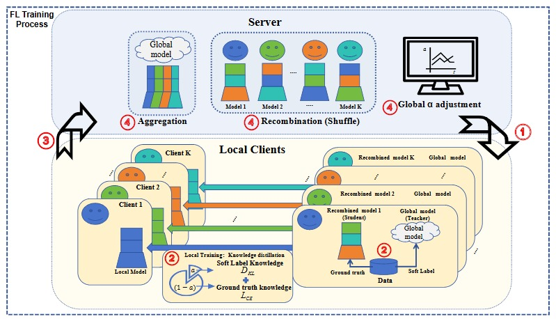
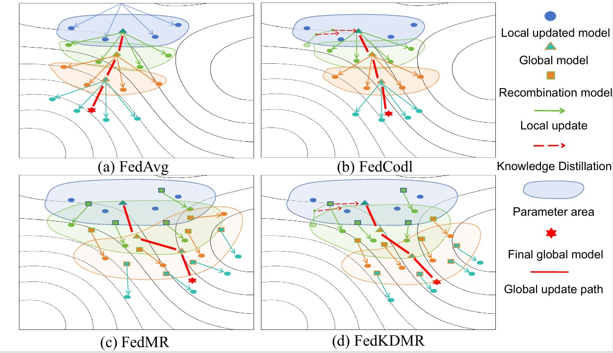

# FedKDMR: Robust Federated Learning via Joint Knowledge Distillation & Model Recombination

--------------------------------------------------------------------------------
## Introduction
FedKDMR imposes global model consistency and robustness in training through dynamic KD while sufficiently harnessing model recombination-induced perturbations for diverse parameter exploration.

## Comparison of Motivations


## Environment setting requirements
* Python 3.10
* PyTorch

## Parameter
#### Dataset Setting
`--dataset <dataset name>`

We can set ‘cifar10’, ‘cifar100’ , ‘fashin-mnist’ and 'emnist' for CIFAR-10, CIFAR-100, Fashion-MNIST and EMNIST.

`--model <model_name>`

We can set ‘resnet20’, ‘vgg’, and ‘cnn’ for ResNet-20, VGG-16, and CNN model.

`--num_classes <number>`

Set the number of classes Set 10 for CIFAR-10
Set 20 for CIFAR-100
Set 10 for Fashion-mnist
Set 26 for Emnist: --emnist_type letters
Set 47 for Emnist:--emnist_type bymerge
Set 62 for Emnist:--emnist_type byclass
`--num_channels <number>`

Set the number of channels of datasets.
Set 3 for CIFAR-10 and CIFAR-100. Set 1 for Fashion-MNIST and EMNIST.

#### Data heterogeneity
`--iid <0 or 1>`

0 – set non-iid 1 – set iid

`--data_beta <β>`

Set the β for the Dirichlet distribution

####  FL Settings
`--epochs <number of rounds>`

Set the number of training rounds.


#### Model setting
`-- algorithm <baseline name>`

* FedKDMR
* FedCodl
* FedMR
* FedAvg
* FedProx
* FedExP

`--KD_alpha <num>` 

Set the number of Distillation weight [0,1).

`-- first_stage_bound <num>`

Set the round number of the first stage for Pre-training


`--KD_buffer_bound <num>`
Set the round number of the first stage for KD buffer. Make sure '-- first_stage_bound' + '--KD_buffer_bound' < '--epochs' to achieve maximum distillation

--------------------------------------------------------------------------------

## Citation
```
@inproceedings{10.1145/3770854.3780160,
author = {Li, Wenhao and Anagnostopoulos, Christos and Puthiya Parambath, Shameem A and Bryson, Kevin},
title = {FedKDMR: Robust Federated Learning via Joint Knowledge Distillation \& Model Recombination},
year = {2026},
booktitle = {Proceedings of the 32nd ACM SIGKDD Conference on Knowledge Discovery and Data Mining V.1},
pages = {724–735},
numpages = {12},
series = {KDD '26}
}
```

## Acknowledgement
An Improved Strategy Based on FedMR's Innovative Recombination Approach. If you wish to further explore the advantages of recombinations in a federated setting, please refer to
```
@inproceedings{hu2024aggregation,
    title={Is Aggregation the Only Choice? Federated Learning via Layer-wise Model Recombination},
    author={Hu, Ming and Yue, Zhihao and Xie, Xiaofei and Chen, Cheng and Huang, Yihao and Wei, Xian and Lian, Xiang and Liu, Yang and Chen, Mingsong},
    booktitle={Proceedings of the 30th ACM SIGKDD Conference on Knowledge Discovery and Data Mining},
    pages={1096--1107},
    year={2024}
}
```
-----------------------------
If you have any questions, please contact me at wenhao.li@glasgow.ac.uk
:blush::blush::blush: Have a nice day :blush::blush::blush: